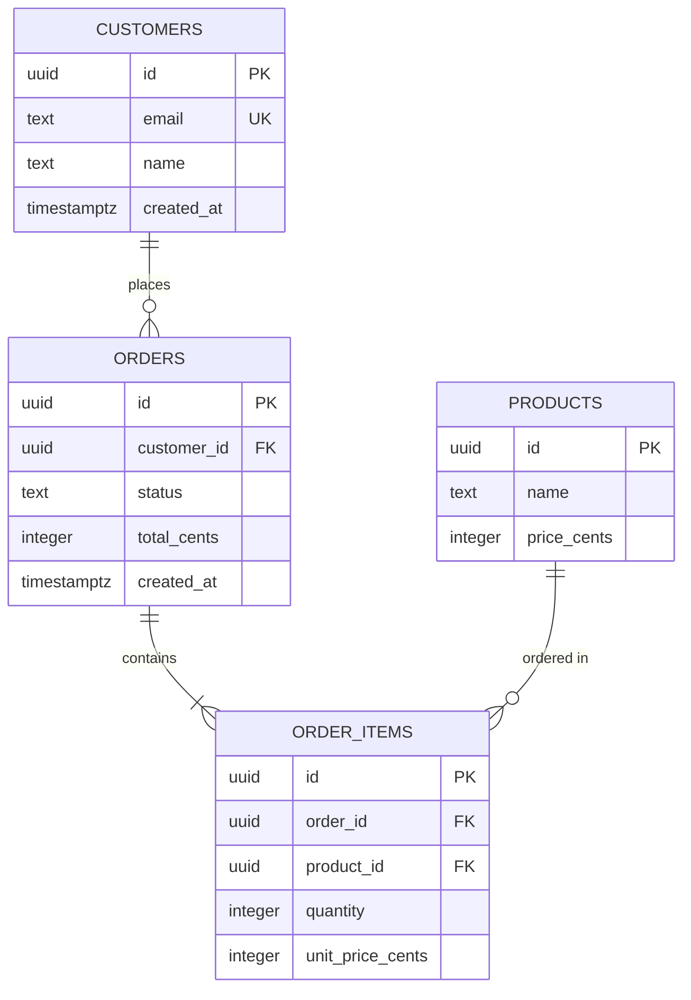

# Schema output formats

## Contents

1. [ERD: Mermaid syntax](#1-erd-mermaid-syntax)
2. [DDL conventions](#2-ddl-conventions)
3. [A complete worked DDL example](#3-a-complete-worked-ddl-example)
4. [ORM-specific generation notes](#4-orm-specific-generation-notes)
5. [The design-rationale doc](#5-the-design-rationale-doc)

## 1. ERD: Mermaid syntax

Default to Mermaid's `erDiagram` syntax — it's plain text, renders inline in most modern chat and documentation surfaces, and needs no external tool. If a proper diagramming tool is available to you in the current environment, prefer it for a nicer visual result, but Mermaid is the reliable, portable fallback.

Mermaid's relationship notation is easy to get backwards, so double-check it rather than guessing: the symbol nearer each entity describes *that entity's* side of the relationship.

```
|o    zero or one        o{    zero or more
||    exactly one        }o    zero or more (crow's foot)
}|    one or more
```

A worked example — customers, orders, and order line items:



Read as: one customer places zero-or-more orders (`||--o{`); one order contains one-or-more order items (`||--|{`, since an order without any items generally shouldn't exist); one product appears in zero-or-more order items (`||--o{`). Mark primary keys `PK`, foreign keys `FK`, and unique constraints `UK` in the attribute blocks — this is what makes the diagram double as a quick-reference schema summary, not just a picture of the boxes and arrows.

## 2. DDL conventions

Pick a consistent formatting style and state it (uppercase SQL keywords is a common convention; it doesn't matter much which you choose, only that it's consistent throughout).

**Always name constraints explicitly** rather than letting the database auto-generate a name:

```sql
-- Avoid: an auto-generated name like "orders_customer_id_fkey" that's
-- awkward to reference later.
customer_id uuid REFERENCES customers(id)

-- Prefer: a name you chose, that reads clearly in a future
-- "ALTER TABLE ... DROP CONSTRAINT ..." migration.
CONSTRAINT fk_orders_customer_id FOREIGN KEY (customer_id) REFERENCES customers(id)
```

This matters more than it looks like it should — the first time you need to drop or modify a specific constraint in a migration, an auto-generated name means going and looking it up first; a chosen name means you already know it.

## 3. A complete worked DDL example

A single table showing the patterns this skill recommends by default, together, so they're visible as a whole rather than scattered across separate examples:

```sql
CREATE TABLE orders (
    id            uuid PRIMARY KEY DEFAULT uuidv7(),
    tenant_id     uuid NOT NULL,
    customer_id   uuid NOT NULL,
    order_number  integer NOT NULL,
    status        text NOT NULL DEFAULT 'pending',
    total_cents   integer NOT NULL,
    currency      char(3) NOT NULL DEFAULT 'USD',
    created_at    timestamptz NOT NULL DEFAULT now(),
    updated_at    timestamptz NOT NULL DEFAULT now(),
    deleted_at    timestamptz,

    CONSTRAINT fk_orders_tenant_id
        FOREIGN KEY (tenant_id) REFERENCES tenants(id),
    CONSTRAINT fk_orders_customer_id
        FOREIGN KEY (customer_id) REFERENCES customers(id) ON DELETE RESTRICT,
    CONSTRAINT chk_orders_status
        CHECK (status IN ('pending', 'paid', 'shipped', 'cancelled', 'refunded')),
    CONSTRAINT chk_orders_total_non_negative
        CHECK (total_cents >= 0),
    CONSTRAINT uq_orders_tenant_order_number
        UNIQUE (tenant_id, order_number)
);

-- Every FK gets an index (§5 of indexing-and-performance.md):
CREATE INDEX idx_orders_tenant_id ON orders (tenant_id);
CREATE INDEX idx_orders_customer_id ON orders (customer_id);

-- Composite index for the actual hot query ("this tenant's open orders"),
-- tenant_id leading per the composite-index-order rule:
CREATE INDEX idx_orders_tenant_status ON orders (tenant_id, status)
    WHERE deleted_at IS NULL;

ALTER TABLE orders ENABLE ROW LEVEL SECURITY;
CREATE POLICY tenant_isolation ON orders
    USING (tenant_id = current_setting('app.current_tenant_id')::uuid);
```

This single table demonstrates: a UUIDv7 surrogate PK, explicit named constraints, a `CHECK`-constrained status column, money as an integer with a currency column, UTC timestamps, soft delete, a decoupled per-tenant order number (backed by whatever counter mechanism was chosen per `keys-and-identifiers.md` §6), FK indexes, a tenant-leading composite index, and RLS. Not every table needs every one of these — this is a reference to pattern-match from, not a template to apply uniformly regardless of what the table actually needs.

## 4. ORM-specific generation notes

Brief, idiomatic pointers per stack — enough to generate code that looks like it was written by someone fluent in that tool, not a generic translation. Confirm the actual stack during the interview (§7 of `requirements-interview.md`) before generating any of this — guessing wrong means throwaway work.

**Prisma** (`schema.prisma`): models map to tables via `@@map` if names differ from Prisma's default; relations are declared on both sides (`orders Order[]` on `Customer`, `customer Customer @relation(fields: [customerId], references: [id])` on `Order`); indexes via `@@index([tenantId, status])`; uniqueness via `@@unique([tenantId, orderNumber])`; use `@db.Timestamptz` to be explicit about timestamp type, and `@default(dbgenerated("uuidv7()"))` for a database-generated UUIDv7 default.

**Drizzle** (`pgTable`): define with `pgTable('orders', { ... })`; columns via `uuid('id').primaryKey().default(sql\`uuidv7()\`)`, `timestamp('created_at', { withTimezone: true }).notNull().defaultNow()`; relations declared separately via `relations()`; indexes via the third argument to `pgTable` using `index()` / `uniqueIndex()`.

**Django** (`models.py`): `class Order(models.Model):` with fields like `id = models.UUIDField(primary_key=True, default=uuid7)`; FKs via `models.ForeignKey('Customer', on_delete=models.RESTRICT)` — note Django forces you to pick an `on_delete` explicitly, which is a genuinely good default behavior aligned with this skill's guidance to treat cascade behavior as a real decision; indexes and multi-column uniqueness via `class Meta: indexes = [...]` and `constraints = [models.UniqueConstraint(...)]`.

**Rails** (ActiveRecord migration + `schema.rb`): `create_table :orders, id: :uuid do |t| ... end` inside a migration file, never hand-edited `schema.rb`; `t.references :customer, foreign_key: true, type: :uuid` adds both the column and the FK constraint together; `add_index :orders, [:tenant_id, :status]`; associations declared in the model (`belongs_to :customer`, `has_many :order_items`) separately from the migration that creates the columns.

**SQLAlchemy** (declarative models): `class Order(Base): __tablename__ = "orders"`; columns via `Mapped[uuid.UUID] = mapped_column(primary_key=True, server_default=text("uuidv7()"))`; relationships via `relationship("Customer", back_populates="orders")`; indexes via `Index("idx_orders_tenant_status", "tenant_id", "status")` or `__table_args__`.

**Raw SQL**: the worked example in §3 above is the target style directly — no translation layer, just correct, explicit, well-constrained DDL.

## 5. The design-rationale doc

Use `assets/schema-design-doc-template.md` as the starting structure for the write-up that accompanies the ERD and code. The template exists specifically to capture the *why* behind non-obvious decisions — the ERD and the DDL already show *what* the schema is; the doc is what answers "why did we do it this way?" when someone (possibly the same user, in six months) asks.
