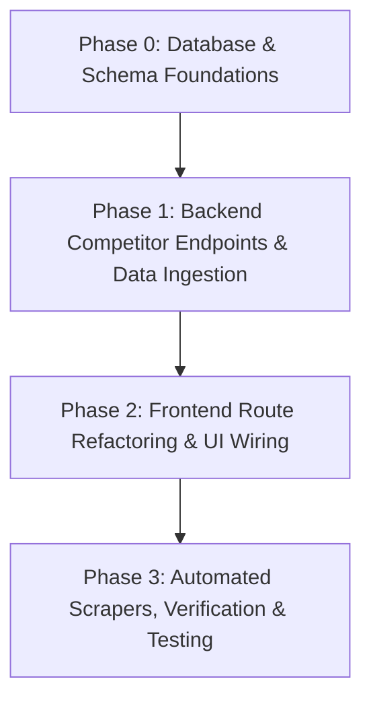

# OShift — Competitors Module Master Integration & Refactoring Plan

| Attribute | Value |
|---|---|
| **Document Purpose** | Comprehensive, step-by-step master engineering plan for making the Competitors module of OShift work correctly end-to-end. |
| **Source Grounding** | Grounded strictly in actual backend source code (`backend/app/`, `backend/tests/`) and migration files (`supabase/migrations/`). |
| **Audit Status** | 100% Repository-Wide Deep Verification Complete |

---

## 1. Executive Summary & Scope

The **Competitors** module is a core pillar of OShift's competitive intelligence engine. Currently, the module suffers from schema conflation (modeling the user's own company inside `competitors.competitors_competitors` with `is_self=true`), missing database metadata columns (`founding_year`, `market_valuation_usd`, `industry`), a broken foreign key constraint in video migrations, missing backend CRUD and aggregation endpoints, stubbed review collectors emitting fake canned data, and a 100% mocked frontend competitor detail page located under a domain route (`/company/[domain]`).

This document lays out the exact multi-phase execution plan to achieve a clean, production-grade, double-prefixed Competitors implementation. Every sub-step is associated directly with the exact backend files, functions, lines, and database migrations that require changes.

---

## 2. Master Phase & Sub-Step Roadmap



---

## Phase 0: Database & Schema Foundations

### Sub-step 0.1: Fix Broken Foreign Key in Video Migration
* **Description**: Migration `20260726_07_video_schema_assets.sql` references `competitors.competitors(id)` (single-prefix name), but the actual double-prefixed table is `competitors.competitors_competitors(id)`. This will fail on fresh database deployments.
* **Database Target**: Table `video.video_assets`
* **Backend Files Affected**:
  - `supabase/migrations/20260726_07_video_schema_assets.sql` (Line 16: replace `REFERENCES competitors.competitors(id)` with `REFERENCES competitors.competitors_competitors(id)`)

---

### Sub-step 0.2: Add Missing Competitor Columns (`founding_year`, `market_valuation_usd`, `industry`)
* **Description**: Add real columns to `competitors.competitors_competitors` to store structured company metadata extracted during web/social scraping and LLM entity enrichment.
* **Database Target**: `competitors.competitors_competitors`
* **Backend Files Affected**:
  - `supabase/migrations/20260727_01_competitor_columns.sql` (NEW Migration File)
    ```sql
    BEGIN;
    ALTER TABLE competitors.competitors_competitors
        ADD COLUMN IF NOT EXISTS founding_year INTEGER,
        ADD COLUMN IF NOT EXISTS market_valuation_usd NUMERIC(18, 2),
        ADD COLUMN IF NOT EXISTS industry TEXT;
    COMMIT;
    ```

---

### Sub-step 0.3: Execute Feature F1 / Decision E3 Migration (Self-Company Schema Isolation)
* **Description**: Create dedicated `company` schema and isolate `competitors.competitors_competitors` to strictly store external competitors.
* **Database Targets**: New schema `company`, tables `company.companies`, `company.social_accounts`, `company.social_post_cache`, `company.analytics_snapshots`, `company.reviews`.
* **Backend Files Affected**:
  - `supabase/migrations/20260727_02_company_schema.sql` (NEW Migration File: SQL DDL + data migration copying `is_self=true` rows to `company.companies`).
  - `backend/app/agent/tools/onboarding.py` (L83-L86: Update `save_onboarding_data` tool to write self-profile to `company.companies`).
  - `backend/app/agent/tools/self_study.py` (L134, L150, L194, L217: Update `scrape_user_company`, `build_self_profile`, `update_self_profile` tools to target `company.companies`).
  - `backend/app/agent/tools/discovery.py` (L59, L457, L461, L834: Remove `is_self` checks from competitor discovery and listing).
  - `backend/app/agent/tools/market.py` (L64, L88, L456: Update `analyze_market_position` self-profile queries to target `company.companies`).
  - `backend/app/agent/memory.py` (L36, L72, L94: Update `load_context` to read self-profile from `company.companies` and competitor counts from `competitors.competitors_competitors`).
  - `backend/app/automation/functions/agent_steps.py` (L61, L123, L168: Remove `WHERE is_self = false` filters from `_run_ads`, `_run_campaigns`, `_run_relationships`).
  - `backend/app/automation/functions/collectors.py` (L225: Remove `WHERE is_self = false` filter from `_run_sense`).
  - `backend/app/automation/functions/crawlers_pipeline.py` (L25, L43: `crawl-own-posts` reads from `company.social_accounts`; `crawl-competitor-posts` removes `is_self=false` filter).
  - `backend/app/insights/router.py` (L251: Remove `AND is_self = false` filter).
  - `backend/app/graph/relationships.py` (L551, L561: Remove `c.is_self` selection and `GROUP BY c.id, c.name, c.is_self` in `_query_workspace_graph()`).
  - `backend/app/social/router.py` (L58-L88: Branch self vs competitor social account creation).
  - `backend/app/social/collector.py` (L53-L66: Update social collector for self company accounts).
  - `backend/app/prompts/agent.py` & `backend/app/prompts/self_profile.py`: Update prompt instructions to reference `company.companies`.
  - `backend/scripts/seed.py`: Update to correctly seed a default `company.companies` row if applicable instead of relying on onboarding/competitors schema.

---

## Phase 1: Backend Competitor Endpoints & Data Ingestion

### Sub-step 1.1: Single Competitor Retrieval Endpoint (`GET /v1/competitors/{competitor_id}`)
* **Description**: Expose an endpoint to fetch detailed metadata for a single competitor by UUID.
* **Backend Files Affected**:
  - `backend/app/competitors/schemas.py`: Update `CompetitorResponse` (L27-L35) to include `founding_year`, `market_valuation_usd`, `industry`, and `metadata`.
  - `backend/app/competitors/router.py`: Add route `GET /v1/competitors/{competitor_id}` executing `SELECT id, workspace_id, name, website, description, founding_year, market_valuation_usd, industry, metadata, created_at FROM competitors.competitors_competitors WHERE id = :cid AND workspace_id = :ws AND deleted_at IS NULL`.

---

### Sub-step 1.2: Batch Competitor Creation & Auto Scrape Trigger (`POST /v1/competitors/batch`)
* **Description**: Allow bulk creation of competitors (e.g. during onboarding) and auto-dispatch background scraping runs via Inngest/WebCollector.
* **Backend Files Affected**:
  - `backend/app/competitors/schemas.py`: Add `CompetitorBatchCreate` and `CompetitorBatchResponse` models.
  - `backend/app/competitors/router.py`: Add route `POST /v1/competitors/batch`. Iterates input payload, performs `INSERT INTO competitors.competitors_competitors`, creates seed `competitors_scrape_runs` and `competitors_scrape_pages`, and enqueues background scrapers via `WebCollector.run_scrape()`.

---

### Sub-step 1.3: Competitor Metrics Aggregation Endpoint (`GET /v1/competitors/{id}/signals/aggregated`)
* **Description**: Aggregate daily/weekly/monthly signal scores, volume, and engagement metrics for the competitor detail page line charts.
* **Backend Files Affected**:
  - `backend/app/competitors/schemas.py`: Add `AggregatedMetricPoint` and `AggregatedMetricsResponse` Pydantic models.
  - `backend/app/competitors/router.py`: Add route `GET /v1/competitors/{competitor_id}/signals/aggregated` with query parameters `metric` (score/volume/engagement), `range` (1m/3m/6m/1y), and `granularity` (day/week/month). Performs SQL `date_trunc()` aggregation on `signals.signals`.

---

### Sub-step 1.4: Add `competitor_id` Filtering to Insights Endpoints
* **Description**: Enable filtering insights (gaps, crises, deals, negative comments) by competitor UUID.
* **Backend Files Affected**:
  - `backend/app/insights/router.py`: Refactor `_make_list_endpoint` (L126-L149) to accept `competitor_id: UUID | None = Query(None)` and `layer: str | None = Query(None)` and append `AND competitor_id = :cid` / `AND layer = :layer` to dynamic queries.

---

### Sub-step 1.5: Extend Campaigns Module for Competitor Campaigns (`GET /v1/campaigns`)
* **Description**: Create/refactor unified campaigns endpoint supporting competitor-scoped query parameters.
* **Backend Files Affected**:
  - `backend/app/campaigns/schemas.py` (NEW/Refactored): Add `CampaignResponse`, `CampaignCreate`, `CampaignUpdate`.
  - `backend/app/campaigns/router.py` (NEW/Refactored): Implement `GET /v1/campaigns?owner_type=competitor&competitor_id={id}` querying `campaigns.campaigns`.
  - `backend/app/insights/campaigns.py` (L183: Update competitor name lookup helper query).
  - `backend/app/router.py`: Register `campaigns.router` into FastAPI shared application router.

---

### Sub-step 1.6: Sense Reviews Filtering & Fake Review Bug Fix
* **Description**: Remove stubbed fake review generator and add review list endpoint.
* **Backend Files Affected**:
  - `backend/app/sense/reviews.py` (L21-L50: Replace `stub_platform_miner` canned response with empty fallback `[]` and warning log).
  - `backend/app/sense/router.py`: Add `GET /v1/sense/reviews?competitor_id={id}` endpoint listing records from `sense.sense_reviews`.

---

### Sub-step 1.7: Update Competitor Agent Tools
* **Description**: Enhance agent tools to handle extended competitor schema fields and support background scraping triggers.
* **Backend Files Affected**:
  - `backend/app/agent/tools/discovery.py`:
    - Update `register_competitor` (L152-L206) to accept and insert `founding_year`, `market_valuation_usd`, `industry`.
    - Update `extract_competitor_products` (L688-L780) to persist enriched metadata.
    - Update `list_competitors` (L451-L500) to return new metadata fields.
    - Add new tool `start_competitor_scrape` accepting `competitor_ids: list[UUID]`.
  - `backend/app/agent/tools/social.py` (L157, L174, L415: Update social profile discovery to check `competitors.competitors_competitors` for competitors and `company.companies` for self company).
  - `backend/app/agent/tools/video.py` (L82, L120: Update competitor video asset tool queries).
  - `backend/app/agent/tools/partnership_sources.py` (L260, L316: Update partnership source metadata updates).

---

## Phase 2: Frontend Route Refactoring & UI Wiring (Competitors Module Scope)

> [!NOTE]
> All frontend paths below refer strictly to the Competitors Module files inside the ACTUAL frontend codebase located at `C:\dev\OShift\Frontend` (the inner path `C:\dev\OShift\OShift\frontend` is a legacy/testing artifact and is explicitly IGNORED).

### Sub-step 2.1: Rename & Refactor Competitor Detail Route
* **Description**: Move/rename mocked domain route to `/competitors/[id]` and connect to backend competitor endpoints.
* **Frontend Files Affected**:
  - `C:\dev\OShift\Frontend\src\app\company\[domain]\page.tsx` → **RENAME/REPURPOSE** to `C:\dev\OShift\Frontend\src\app\competitors\[id]\page.tsx` (Route `/competitors/[id]`).
  - `C:\dev\OShift\Frontend\src\app\competitors\[id]\page.tsx`:
    - Refactor URL params to read competitor UUID (`params.id`).
    - Replace all mock arrays with real backend API calls:
      - Identity & Header → `GET /v1/competitors/{id}`
      - 3 Line Charts → `GET /v1/competitors/{id}/signals/aggregated?metric=score|volume|engagement&range=6m`
      - Strategic Gaps → `GET /v1/insights/gaps?competitor_id={id}`
      - Active Competitor Campaigns → `GET /v1/campaigns?owner_type=competitor&competitor_id={id}`
      - Customer Voice / Reviews → `GET /v1/sense/reviews?competitor_id={id}`

---

### Sub-step 2.2: Update Competitors List View
* **Description**: Update main competitors grid view to use the double-prefixed schema endpoint and navigate to `/competitors/[id]`.
* **Frontend Files Affected**:
  - `C:\dev\OShift\Frontend\src\app\competitors\page.tsx`:
    - Remove `!c.is_self` client filter (the user's own company is stored in `company.companies` via Feature F1 / Decision E3 and will no longer be returned by `GET /v1/competitors`).
    - Update card click action: Change `router.push('/company/${domain}...')` → `router.push('/competitors/${company.id}')`.
    - Render new metadata fields extracted by scrapers/LLM (`industry`, `founding_year`, `market_valuation_usd`).
    - Connect single competitor deletion button to `DELETE /v1/competitors/{id}`.

---

### Sub-step 2.3: Wire Onboarding Competitor Form
* **Description**: Connect onboarding competitor addition form to bulk creation API.
* **Frontend Files Affected**:
  - `C:\dev\OShift\Frontend\src\app\onboarding\step-2\page.tsx`:
    - Update form submit handler to POST competitor array payload to `POST /v1/competitors/batch`.
    - Auto-dispatch background scraping runs via WebCollector enqueue.

---

### Sub-step 2.4: Connect Competitor API & Model Layer
* **Description**: Extend shared API library with competitor data models and typed fetch helpers.
* **Frontend Files Affected**:
  - `C:\dev\OShift\Frontend\src\lib\api.ts`:
    - Add TypeScript interfaces: `Competitor`, `CompetitorBatchCreate`, `AggregatedMetricsPoint`, `AggregatedMetricsResponse`, `InsightGap`, `Campaign`, `SenseReview`.
    - Export typed helper fetchers: `getCompetitor(id)`, `createCompetitorsBatch(items)`, `getCompetitorAggregatedMetrics(id, metric, range)`, `getInsightsGaps(competitorId)`, `getSenseReviews(competitorId)`.

### Sub-step 2.5: Navigation Link Alignment (`C:\dev\OShift\Frontend\src\components\Sidebar.tsx`)
- [ ] Update any hardcoded navigation links pointing to `/company/[domain]` to `/competitors/[id]` if necessary.
- [ ] Ensure the Competitors tab accurately reflects the new structure.

### Sub-step 2.6: Profile Page Refactoring (`C:\dev\OShift\Frontend\src\app\profile\page.tsx`)
- [ ] Address **Feature F1** from the gap analysis: The profile page currently conflates the user's employer with tracked competitors.
- [ ] Replace the hardcoded `PROFILE_DATA.competitors` array in the "Monitored Competitors" section.
- [ ] Wire the section to fetch actual competitor data from the overhauled `GET /v1/competitors` API.

### Sub-step 2.7: Partnerships API Update (`C:\dev\OShift\Frontend\src\app\partnerships\page.tsx`)
- [ ] Audit the `apiFetch<Competitor[]>('/competitors')` call on line 111.
- [ ] Ensure the component's data mapping logic handles the new API payload shape (which no longer includes the `is_self=true` row).
- [ ] Update local TypeScript interfaces (like `Competitor`) if the backend schema changes introduce new required fields.

---

## Phase 3: Verification & Automated Testing

### Sub-step 3.1: Unit & Integration Test Updates
* **Backend Files Affected**:
  - `backend/tests/unit/test_agent_tools.py` (L730-L772: Update mock expectations for `competitors.competitors_competitors` and `is_self` removal).
  - `backend/tests/unit/test_agent_capabilities.py` (L98, L351: Update tests checking `register_competitor` and `save_onboarding_data`).
  - `backend/tests/unit/test_relationships.py` (L287: Update test mocks).
  - `backend/tests/unit/test_insights.py`: Update insight engine unit test mocks.
  - `backend/tests/unit/test_battlecards.py`: Update battlecard generation test mocks.
  - `backend/tests/integration/test_competitors.py` (NEW/Updated: Integration tests for `/v1/competitors/{id}`, `/v1/competitors/batch`, and aggregation endpoints).

---

## 3. Comprehensive File Impact Index

| File Path | Phase / Sub-step | Primary Action | Key Details / Line Numbers |
|---|---|---|---|
| `supabase/migrations/20260726_07_video_schema_assets.sql` | 0 / 0.1 | Modify | Fix FK line 16 (`competitors_competitors`) |
| `supabase/migrations/20260727_01_competitor_columns.sql` | 0 / 0.2 | Create | Add `founding_year`, `market_valuation_usd`, `industry` |
| `supabase/migrations/20260727_02_company_schema.sql` | 0 / 0.3 | Create | DDL + Data migration for `company` schema (isolates competitors) |
| `backend/scripts/seed.py` | 0 / 0.3 | Modify | Seed `company.companies` if necessary |
| `backend/app/agent/tools/onboarding.py` | 0 / 0.3 | Modify | Write self profile to `company.companies` (L83-L86) |
| `backend/app/agent/tools/self_study.py` | 0 / 0.3 | Modify | Target `company.companies` (L134, L150, L194, L217) |
| `backend/app/agent/tools/discovery.py` | 0/0.3, 1/1.7 | Modify | Remove `is_self` filters; update `register_competitor` (L152-L206); add `start_competitor_scrape` |
| `backend/app/agent/tools/market.py` | 0 / 0.3 | Modify | Update self-profile queries to `company.companies` (L64, L88, L456) |
| `backend/app/agent/tools/social.py` | 1 / 1.7 | Modify | Target `company.companies` for self company (L157, L174, L415) |
| `backend/app/agent/tools/video.py` | 1 / 1.7 | Modify | Competitor video asset tool queries (L82, L120) |
| `backend/app/agent/tools/partnership_sources.py` | 1 / 1.7 | Modify | Partnership source metadata updates (L260, L316) |
| `backend/app/agent/memory.py` | 0 / 0.3 | Modify | Read self-profile from `company.companies` (L36, L72, L94) |
| `backend/app/automation/functions/agent_steps.py` | 0 / 0.3 | Modify | Remove `is_self=false` filters (L61, L123, L168) |
| `backend/app/automation/functions/collectors.py` | 0 / 0.3 | Modify | Remove `is_self=false` filter (L225) |
| `backend/app/automation/functions/crawlers_pipeline.py` | 0 / 0.3 | Modify | Update `crawl-own-posts` & `crawl-competitor-posts` (L25, L43) |
| `backend/app/insights/router.py` | 0/0.3, 1/1.4 | Modify | Remove `is_self` filter (L251); add `competitor_id` filter (L126-L149) |
| `backend/app/insights/campaigns.py` | 1 / 1.5 | Modify | Competitor name lookup query (L183) |
| `backend/app/graph/relationships.py` | 0 / 0.3 | Modify | Remove `c.is_self` column query and grouping (L551, L561) |
| `backend/app/social/router.py` | 0 / 0.3 | Modify | Branch self vs competitor social accounts (L58-L88) |
| `backend/app/social/collector.py` | 0 / 0.3 | Modify | Update social collector for self accounts (L53-L66) |
| `backend/app/competitors/schemas.py` | 1 / 1.1-1.3 | Modify | Add `founding_year`, `market_valuation_usd`, `industry`, Batch & Aggregation models |
| `backend/app/competitors/router.py` | 1 / 1.1-1.3 | Modify | Add `GET /{id}`, `POST /batch`, `GET /{id}/signals/aggregated` |
| `backend/app/sense/reviews.py` | 1 / 1.6 | Modify | Replace `stub_platform_miner` with empty fallback (L21-L50) |
| `backend/app/sense/router.py` | 1 / 1.6 | Modify | Add `GET /v1/sense/reviews` list endpoint |
| `backend/app/campaigns/schemas.py` | 1 / 1.5 | Create/Modify | Add campaign Pydantic models |
| `backend/app/campaigns/router.py` | 1 / 1.5 | Create/Modify | Add `GET /v1/campaigns?owner_type=competitor&competitor_id=` |
| `backend/app/router.py` | 1 / 1.5 | Modify | Register `campaigns.router` |
| `C:\dev\OShift\Frontend\src\app\company\[domain]\page.tsx` → `src\app\competitors\[id]\page.tsx` | 2 / 2.1 | Rename/Repurpose | Route `/competitors/[id]`; wire 5 real backend competitor endpoints |
| `C:\dev\OShift\Frontend\src\app\competitors\page.tsx` | 2 / 2.2 | Modify | Remove `!c.is_self` client filter; navigate to `/competitors/${id}`; display new metadata |
| `C:\dev\OShift\Frontend\src\app\onboarding\step-2\page.tsx` | 2 / 2.3 | Modify | Wire competitor batch submit to `POST /v1/competitors/batch` |
| `C:\dev\OShift\Frontend\src\lib\api.ts` | 2 / 2.4 | Modify | Add Competitor domain interfaces & typed API helper fetchers |
| `C:\dev\OShift\Frontend\src\components\Sidebar.tsx` | 2 / 2.5 | Modify | Update `/competitors` nav item and route active state |
| `backend/tests/unit/test_agent_tools.py` | 3 / 3.1 | Modify | Update double-prefix & `is_self` mock tests (L730-L772) |
| `backend/tests/unit/test_agent_capabilities.py` | 3 / 3.1 | Modify | Update capability tests (L98, L351) |
| `backend/tests/unit/test_relationships.py` | 3 / 3.1 | Modify | Update relationship mock tests (L287) |
| `backend/tests/unit/test_insights.py` | 3 / 3.1 | Modify | Update insight engine test mocks |
| `backend/tests/unit/test_battlecards.py` | 3 / 3.1 | Modify | Update battlecards test mocks |
| `backend/tests/integration/test_competitors.py` | 3 / 3.1 | Create/Modify | Integration tests for new competitor endpoints |

---

## 4. Verification Checklist

- [ ] Execute Migration 0.1 (`20260726_07_video_schema_assets.sql` FK fix).
- [ ] Apply Migration 0.2 (`20260727_01_competitor_columns.sql`).
- [ ] Apply Migration 0.3 (`20260727_02_company_schema.sql`).
- [ ] Verify `pytest tests/unit/` passes cleanly across all test suites.
- [ ] Verify `POST /v1/competitors/batch` creates records and dispatches background Inngest scrape runs.
- [ ] Verify `GET /v1/competitors/{id}` returns complete company metadata.
- [ ] Verify `GET /v1/competitors/{id}/signals/aggregated` returns clean time-series metric points.
- [ ] Verify frontend navigation `/competitors/[id]` displays real backend signals, gaps, campaigns, and reviews.

